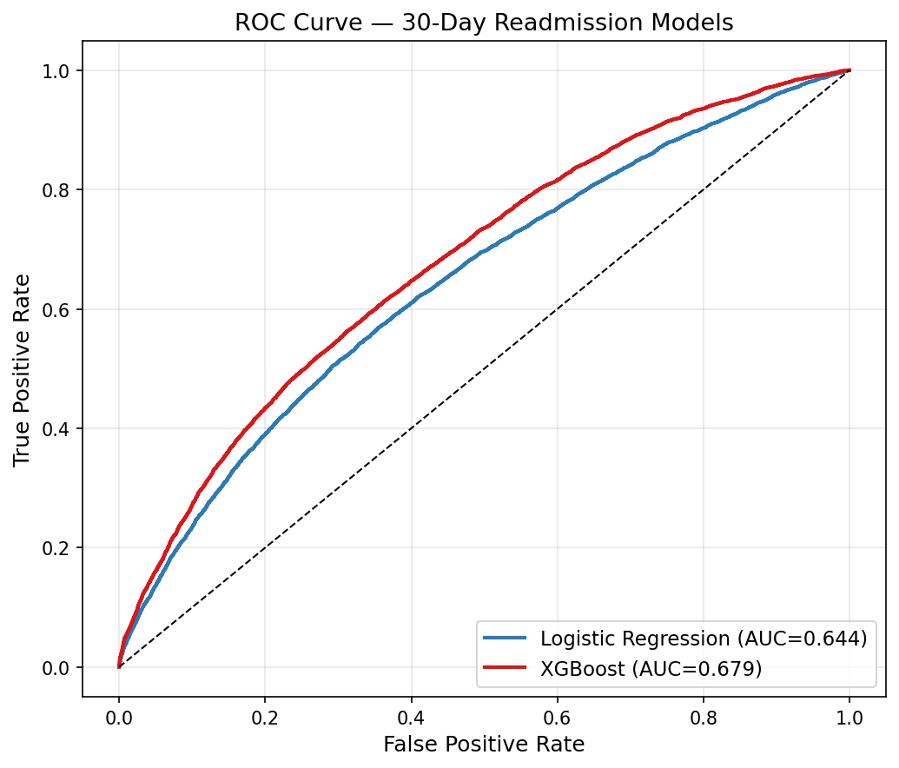
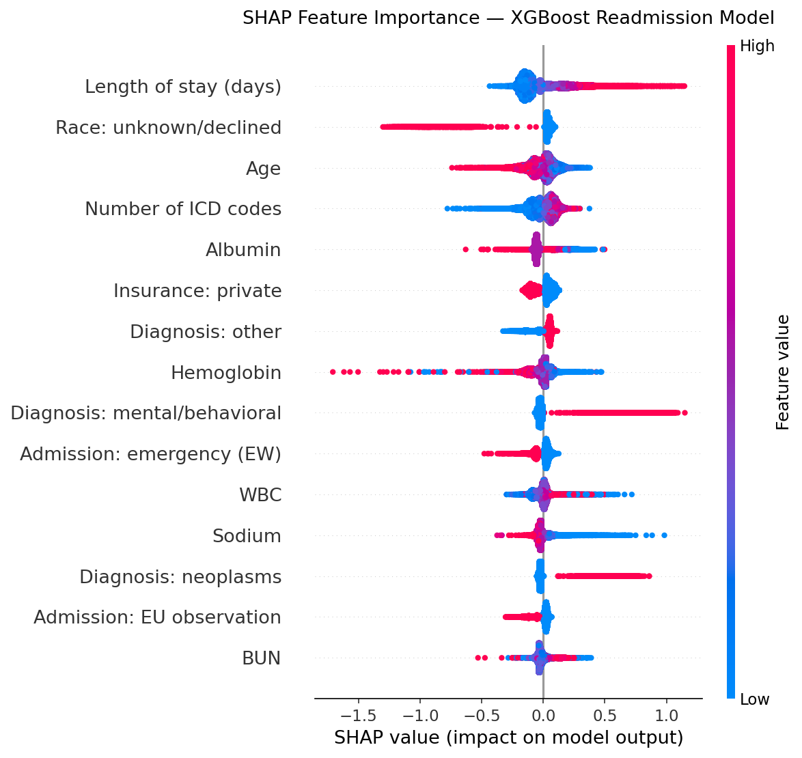

## Executive Summary

Unplanned 30-day readmissions are among the most costly and measurable failures in post-acute care, costing the U.S. healthcare system an estimated $26 billion annually. Under the CMS Hospital Readmissions Reduction Program, hospitals face Medicare payment penalties of up to 3% for excess readmissions in priority conditions including heart failure, pneumonia, and COPD.

This analysis applies multivariable logistic regression to 220,798 adult index admissions from the MIMIC-IV database to identify administrative and demographic predictors of 30-day readmission. Key findings:

- **15.1% readmission rate** (33,342 of 220,798 admissions) — consistent with national benchmarks
- **Mental/Behavioral disorders** (OR 3.26) and **Neoplasms** (OR 2.34) carried the highest adjusted readmission odds among diagnosis categories
- **Each additional hospital day** increased readmission odds by 4% (OR 1.04), reflecting illness severity
- **Emergency admissions** had the highest readmission risk by admission type (OR 1.49)
- Model **AUC: 0.637** — addition of prior utilization (OR 1.73) and comorbidity
features improved discrimination over a demographic-only baseline; clinical variables
(labs, vitals) would improve further

**Clinical implication:** At discharge, patients with psychiatric or oncologic diagnoses, extended lengths of stay, and emergency admission status represent the highest-priority group for care management follow-up and post-discharge outreach.

---

## Background

Hospital readmissions within 30 days of discharge represent a measurable and often preventable failure in the care continuum. They account for an estimated $26 billion in annual U.S. healthcare spending, and under the CMS Hospital Readmissions Reduction Program (HRRP) — active since 2012 — hospitals face Medicare payment reductions of up to 3% for excess readmissions in six priority conditions: heart failure, acute myocardial infarction, pneumonia, COPD, hip and knee replacement, and coronary artery bypass graft surgery.

Beyond financial penalties, high readmission rates signal gaps in discharge planning, post-acute follow-up, and care transitions. Identifying which patients are at elevated risk at the time of discharge gives clinical teams an actionable window: a care management referral, a scheduled outpatient call at day 3, or a social work consult before the patient leaves the building can meaningfully reduce the probability of return.

This analysis uses MIMIC-IV, a large de-identified EHR dataset from Beth Israel Deaconess Medical Center (2008–2022), to build and evaluate a 30-day readmission risk model using administrative and demographic variables. The goal is not only to achieve the best possible discrimination, but to identify which patient characteristics are most strongly associated with readmission — information a care operations team can act on today, with data already available in any EHR at discharge.

## Data and Cohort Definition

MIMIC-IV contains de-identified health data for patients admitted to Beth Israel Deaconess Medical Center between 2008 and 2022. The analysis draws on three tables: `admissions`, `patients`, and `diagnoses_icd`. Index admissions were defined as each patient's first non-elective, non-newborn hospitalization where the patient survived to discharge and was at least 18 years of age. A readmission was defined as any return hospitalization to the same institution within 30 days of the index discharge date.

```{r setup, include=FALSE}
#| cache: false
library(rprojroot)
library(DBI)
library(duckdb)
library(tidyverse)
library(tableone)
library(gtsummary)
library(pROC)
library(survival)
library(here)

root <- find_rstudio_root_file()
knitr::opts_knit$set(root.dir = root)

con <- dbConnect(duckdb(), dbdir = ":memory:")

adm_path <- file.path(root, "mimic-iv/hosp/admissions.csv.gz")
pat_path  <- file.path(root, "mimic-iv/hosp/patients.csv.gz")
dx_path   <- file.path(root, "mimic-iv/hosp/diagnoses_icd.csv.gz")

dbExecute(con, paste0("CREATE VIEW admissions AS SELECT * FROM read_csv_auto('", adm_path, "')"))
dbExecute(con, paste0("CREATE VIEW patients AS SELECT * FROM read_csv_auto('", pat_path, "')"))
dbExecute(con, paste0("CREATE VIEW diagnoses_icd AS SELECT * FROM read_csv_auto('", dx_path, "')"))
```

```{r cohort_construction}
cohort <- dbGetQuery(con, "
  WITH age_calc AS (
    SELECT 
      a.subject_id,
      a.hadm_id,
      a.admittime,
      a.dischtime,
      a.deathtime,
      a.admission_type,
      a.admission_location,
      a.discharge_location,
      a.insurance,
      a.marital_status,
      a.race,
      a.hospital_expire_flag,
      p.gender,
      p.anchor_age,
      p.dod
    FROM admissions a
    JOIN patients p ON a.subject_id = p.subject_id
    WHERE 
      p.anchor_age >= 18
      AND a.hospital_expire_flag = 0
      AND a.dischtime IS NOT NULL
      AND a.admission_type NOT IN ('ELECTIVE', 'NEWBORN')
  ),
  ranked AS (
    SELECT *,
      ROW_NUMBER() OVER (
        PARTITION BY subject_id 
        ORDER BY admittime ASC
      ) AS admission_rank
    FROM age_calc
  ),
  index_admissions AS (
    SELECT * FROM ranked WHERE admission_rank = 1
  ),
  readmissions AS (
    SELECT 
      a.subject_id,
      a.hadm_id AS readmit_hadm_id,
      a.admittime AS readmit_time
    FROM admissions a
    JOIN index_admissions i ON a.subject_id = i.subject_id
    WHERE 
      a.hadm_id != i.hadm_id
      AND a.admittime > i.dischtime
      AND a.admittime <= i.dischtime + INTERVAL 30 DAYS
  )
  SELECT 
    i.*,
    CASE WHEN r.subject_id IS NOT NULL THEN 1 ELSE 0 END AS readmitted_30d,
    r.readmit_time  -- add this line
  FROM index_admissions i
  LEFT JOIN readmissions r ON i.subject_id = r.subject_id
")

primary_dx <- dbGetQuery(con, "
  SELECT hadm_id, icd_code, icd_version
  FROM (
    SELECT *,
      ROW_NUMBER() OVER (PARTITION BY hadm_id ORDER BY seq_num) AS rn
    FROM diagnoses_icd
    WHERE seq_num = 1
  ) sub
  WHERE rn = 1
")

cohort <- cohort |>
  left_join(primary_dx, by = "hadm_id") |>
  mutate(
    icd3 = substr(icd_code, 1, 3),
    disease_category = case_when(
      icd_version == 10 & icd3 >= "I00" & icd3 <= "I99" ~ "Circulatory",
      icd_version == 10 & icd3 >= "J00" & icd3 <= "J99" ~ "Respiratory",
      icd_version == 10 & icd3 >= "K00" & icd3 <= "K99" ~ "Digestive",
      icd_version == 10 & icd3 >= "N00" & icd3 <= "N99" ~ "Genitourinary",
      icd_version == 10 & icd3 >= "C00" & icd3 <= "D49" ~ "Neoplasms",
      icd_version == 10 & icd3 >= "E00" & icd3 <= "E89" ~ "Endocrine/Metabolic",
      icd_version == 10 & icd3 >= "F00" & icd3 <= "F99" ~ "Mental/Behavioral",
      icd_version == 10 & icd3 >= "S00" & icd3 <= "T98" ~ "Injury/Poisoning",
      TRUE ~ "Other"
    )
  )
```

## Methods

Predictor variables included patient demographics (age, gender, race/ethnicity), socioeconomic indicators (insurance type, marital status), clinical context (admission type, primary diagnosis category, length of stay), prior utilization (number of admissions in the 6 months preceding the index admission), comorbidity burden (total ICD codes per admission), and a binary flag for high-risk Elixhauser conditions including CHF, COPD, chronic kidney disease, malignancy, and major psychiatric diagnoses. Primary ICD codes were mapped to broad disease categories using ICD-10 chapter ranges. Admissions coded under ICD-9 or without a mappable primary diagnosis were retained and classified as "Other." Missing values in marital status (n = 10,001) and insurance (n = 6,909) were handled via complete case analysis within the regression model. A multivariable logistic regression model was fit to estimate adjusted odds ratios for 30-day readmission. Model discrimination was assessed using the area under the receiver operating characteristic curve (AUC). A Kaplan-Meier curve was used to visualize time to readmission among the readmitted cohort.

```{r data_cleaning}
cohort_clean <- cohort |>
  mutate(
    readmitted_30d = factor(readmitted_30d, levels = c(0, 1), labels = c("No", "Yes")),
    gender = factor(gender),
    insurance = factor(insurance),
    marital_status = factor(marital_status),
    race = factor(race),
    race_collapsed = case_when(
      str_detect(race, "WHITE") ~ "White",
      str_detect(race, "BLACK") ~ "Black/African American",
      str_detect(race, "HISPANIC") ~ "Hispanic/Latino",
      str_detect(race, "ASIAN") ~ "Asian",
      race == "UNKNOWN" | race == "UNABLE TO OBTAIN" |
        race == "PATIENT DECLINED TO ANSWER" ~ "Unknown/Declined",
      TRUE ~ "Other"
    ),
    race_collapsed = factor(race_collapsed),
    admission_type = factor(admission_type),
    disease_category = factor(disease_category),
    los = as.numeric(difftime(dischtime, admittime, units = "days"))
  ) |>
  filter(los >= 0) |>
  select(
    subject_id, hadm_id, readmitted_30d, gender, anchor_age,
    insurance, marital_status, race, race_collapsed,
    admission_type, disease_category, los
  )
```

```{r feature_engineering}
#| cache: true

# Prior utilization: admissions in 6 and 12 months before index admission
prior_util <- dbGetQuery(con, "
  WITH index_admits AS (
    SELECT 
      a.subject_id,
      a.hadm_id,
      a.admittime AS index_admittime
    FROM admissions a
    JOIN (
      SELECT subject_id, MIN(admittime) AS first_admit
      FROM admissions
      WHERE admission_type NOT IN ('ELECTIVE', 'NEWBORN')
      GROUP BY subject_id
    ) first ON a.subject_id = first.subject_id 
           AND a.admittime = first.first_admit
  ),
  prior_counts AS (
    SELECT 
      i.hadm_id,
      COUNT(CASE WHEN a.admittime >= i.index_admittime - INTERVAL 6 MONTHS
                  AND a.admittime < i.index_admittime THEN 1 END) AS prior_admits_6m,
      COUNT(CASE WHEN a.admittime >= i.index_admittime - INTERVAL 12 MONTHS
                  AND a.admittime < i.index_admittime THEN 1 END) AS prior_admits_12m
    FROM index_admits i
    LEFT JOIN admissions a ON i.subject_id = a.subject_id
    GROUP BY i.hadm_id
  )
  SELECT * FROM prior_counts
")

# Comorbidity burden: total ICD codes per admission (already have diagnoses_icd loaded)
comorbidity <- dbGetQuery(con, "
  SELECT
    hadm_id,
    COUNT(*) AS n_icd_codes,
    -- Binary flags for high-risk Elixhauser conditions
    MAX(CASE WHEN icd_version = 10 AND (
      icd_code LIKE 'I50%'                  -- CHF
      OR icd_code LIKE 'J44%'              -- COPD
      OR icd_code LIKE 'N18%'              -- Chronic kidney disease
      OR icd_code LIKE 'C%'               -- Malignancy
      OR icd_code LIKE 'E11%'             -- Type 2 diabetes
      OR icd_code LIKE 'E10%'             -- Type 1 diabetes
      OR icd_code LIKE 'F20%'             -- Schizophrenia
      OR icd_code LIKE 'F31%'             -- Bipolar
      OR icd_code LIKE 'F32%' OR icd_code LIKE 'F33%'  -- Depression
    ) THEN 1 ELSE 0 END) AS high_risk_comorbidity
  FROM diagnoses_icd
  GROUP BY hadm_id
")

# Join both onto cohort_clean
cohort_clean <- cohort_clean |>
  left_join(prior_util, by = "hadm_id") |>
  left_join(comorbidity, by = "hadm_id") |>
  mutate(
    prior_admits_6m  = replace_na(prior_admits_6m, 0),
    prior_admits_12m = replace_na(prior_admits_12m, 0),
    n_icd_codes      = replace_na(n_icd_codes, 0),
    high_risk_comorbidity = factor(replace_na(high_risk_comorbidity, 0)),
    any_prior_admit  = factor(ifelse(prior_admits_6m > 0, 1, 0))
  )
```

## Cohort Characteristics

The final cohort included 220,798 index admissions, of which 33,342 (15.1%) resulted in a readmission within 30 days. Table 1 presents cohort characteristics stratified by readmission status. Readmitted patients were slightly older on average (56.4 vs 55.0 years), more likely to be covered by Medicare (41.3% vs 36.4%), and had substantially longer index stays (mean LOS 6.17 vs 4.11 days). Mental/Behavioral and Neoplasm diagnoses were notably overrepresented among readmitted patients relative to their overall cohort share.

```{r table_one}
vars <- c("gender", "anchor_age", "insurance", "marital_status",
          "race_collapsed", "admission_type", "disease_category", "los")

cat_vars <- c("gender", "insurance", "marital_status",
              "race_collapsed", "admission_type", "disease_category")

table1 <- CreateTableOne(
  vars = vars,
  strata = "readmitted_30d",
  data = cohort_clean,
  factorVars = cat_vars,
  addOverall = TRUE
)

print(table1, showAllLevels = FALSE, quote = FALSE, noSpaces = TRUE)
```

## Logistic Regression Results

A multivariable logistic regression identified several significant predictors of 30-day
readmission. Prior admissions in the 6 months before the index stay carried the highest
adjusted odds of readmission (OR 1.73, p < 0.001), consistent with published literature
identifying prior utilization as the strongest administrative predictor of return
hospitalization. Among diagnosis categories, Mental/Behavioral disorders (OR 3.31,
p < 0.001) and Neoplasms (OR 2.35, p < 0.001) carried the highest adjusted odds
relative to circulatory conditions. Each additional day of length of stay increased
readmission odds by 2% (OR 1.02, p < 0.001), and each additional ICD code on the
admission record increased odds by 2% (OR 1.02, p < 0.001), reflecting cumulative
comorbidity burden. Direct Emergency admissions had the highest readmission odds
among admission types (OR 1.41, p < 0.001). Patients with private insurance had lower
readmission odds compared to Medicaid (OR 0.86, p < 0.001).

```{r logistic_regression}
#| cache: true
model <- glm(
  readmitted_30d ~ gender + anchor_age + insurance + marital_status +
    race_collapsed + admission_type + disease_category + los +
    prior_admits_6m + n_icd_codes + high_risk_comorbidity,
  data = cohort_clean,
  family = binomial(link = "logit")
)

pred_probs <- predict(model, type = "response")
roc_obj <- roc(
  response = model$model$readmitted_30d,
  predictor = pred_probs,
  levels = c("No", "Yes"),
  direction = "<"
)
auc_val <- round(auc(roc_obj), 3)

tbl_regression(
  model,
  exponentiate = TRUE,
  conf.int = TRUE,
  estimate_fun = purrr::partial(style_ratio, digits = 2),
  include = c(
    "gender", "anchor_age", "insurance", "admission_type",
    "disease_category", "los", "prior_admits_6m",
    "n_icd_codes", "high_risk_comorbidity"
  ),
  label = list(
    gender ~ "Gender",
    anchor_age ~ "Age",
    insurance ~ "Insurance Type",
    admission_type ~ "Admission Type",
    disease_category ~ "Disease Category",
    los ~ "Length of Stay (days)",
    prior_admits_6m ~ "Prior admissions (6 months)",
    n_icd_codes ~ "Number of ICD codes",
    high_risk_comorbidity ~ "High-risk comorbidity"
  )
) |>
  bold_p(t = 0.05) |>
  bold_labels() |>
  add_significance_stars()
```

## Model Performance

The logistic regression model achieved an AUC of `r auc_val`, indicating modest 
discriminative ability. Adding prior utilization, comorbidity burden, and high-risk 
condition flags improved discrimination relative to a demographic-only baseline. 
The model remains limited by the absence of clinical variables such as laboratory 
values and vital signs, which are expected to improve performance further. The ROC 
curve is presented below.

```{r roc_curve}
#| cache: false
plot(
  roc_obj,
  col = "#2C7BB6",
  lwd = 2,
  main = paste0("ROC Curve — 30-Day Readmission Model (AUC = ", auc_val, ")"),
  xlab = "False Positive Rate (1 - Specificity)",
  ylab = "True Positive Rate (Sensitivity)"
)
abline(a = 0, b = 1, lty = 2, col = "gray")
```

## Time to Readmission

Among patients who were readmitted within 30 days, the Kaplan-Meier curve below illustrates the probability of remaining readmission-free over time following the index discharge. The curve shows a steady decline in the survival probability across the 30-day window, with no pronounced clustering at a single time point.

```{r survival_curve}
surv_data <- cohort_clean |>
  left_join(
    cohort |> select(hadm_id, readmit_time, dischtime),
    by = "hadm_id"
  ) |>
  mutate(
    readmitted_num = ifelse(readmitted_30d == "Yes", 1, 0),
    days_to_event = case_when(
      readmitted_num == 1 ~ as.numeric(
        difftime(readmit_time, dischtime, units = "days")
      ),
      TRUE ~ 30  # censored at 30 days for non-readmitted patients
    ),
    days_to_event = pmin(pmax(days_to_event, 0), 30)  # clamp to [0, 30]
  ) |>
  filter(!is.na(days_to_event))

km_fit <- survfit(
  Surv(days_to_event, readmitted_num) ~ 1,
  data = surv_data
)

plot(
  km_fit,
  xlab = "Days Since Discharge",
  ylab = "Probability of No Readmission",
  main = "Kaplan-Meier Curve — Time to 30-Day Readmission",
  col = "#2C7BB6",
  lwd = 2,
  conf.int = TRUE,
  xlim = c(0, 30)
)
```

## Model Comparison: Logistic Regression vs. XGBoost

To assess whether a non-linear model could improve discrimination beyond the administrative baseline, an XGBoost classifier was trained on an expanded feature set incorporating laboratory values available at discharge — creatinine, BUN, hemoglobin, WBC, sodium, albumin, and bicarbonate — in addition to the administrative and utilization features from the logistic regression model. Both models were evaluated on a held-out 20% test set (n = 44,168) using area under the ROC curve (AUC).

| Model | Features | AUC |
|---|---|---|
| Logistic regression (R, admin only) | Demographics, diagnosis, LOS, insurance | 0.632 |
| Logistic regression (Python, + utilization + labs) | + Prior admissions, comorbidity count, 8 lab values | 0.644 |
| XGBoost (Python, + utilization + labs) | Same expanded feature set | 0.679 |

Adding prior utilization and lab features improved logistic regression AUC from 0.632 to 0.644. XGBoost on the same feature set achieved AUC 0.679, capturing non-linear relationships and feature interactions that logistic regression cannot model. The ROC curves for both Python models are shown below.



## Feature Importance: SHAP Analysis

To understand which features drive individual-level readmission predictions in the XGBoost model, SHAP (SHapley Additive exPlanations) values were computed on the test set. The beeswarm plot below shows the 15 most impactful features, where each point represents one patient, horizontal position indicates the direction and magnitude of impact on predicted readmission risk, and color indicates the feature value (red = high, blue = low).



Length of stay was the strongest individual predictor — longer stays (red) substantially increased predicted readmission risk, consistent with its role as a proxy for illness severity. Mental/Behavioral and Neoplasm diagnoses showed strong positive SHAP values, confirming the logistic regression findings. Low albumin and low hemoglobin both increased risk, reflecting nutritional status and anemia as clinically meaningful readmission drivers that administrative-only models miss entirely. Prior admission count, while a strong predictor in the logistic regression, was partially absorbed by the lab features in the XGBoost model but remains an important utilization signal.

**Clinical implication:** Patients presenting with extended stays, psychiatric or oncologic diagnoses, low albumin, or low hemoglobin at discharge represent the highest-priority group for care management intervention — and these signals are available in any EHR at the time of discharge.

## Limitations

This analysis has several limitations. First, the model relies exclusively on administrative and demographic variables; incorporating clinical features such as laboratory values, vital signs, or validated comorbidity indices (e.g., Charlson Comorbidity Index) would likely improve predictive performance. Second, a large proportion of admissions (71%) were coded under ICD-9 or lacked a mappable primary ICD-10 diagnosis and were grouped into an "Other" category, reducing diagnostic granularity. Third, MIMIC-IV represents a single academic medical center in Boston, which limits the generalizability of findings to other hospital systems or patient populations. Fourth, length of stay is used as a proxy for illness severity rather than a direct clinical severity score.

## Conclusion

This analysis demonstrates that administrative and utilization-based EHR variables are meaningfully associated with 30-day readmission risk. Prior utilization, diagnosis category, and comorbidity burden emerged as the strongest predictors, with Mental/Behavioral and Neoplasm diagnoses warranting particular attention in discharge planning and post-acute follow-up programs. The baseline model achieved an AUC of 0.637 using only administrative features available at discharge in any EHR — a foundation that future work should extend by incorporating clinical variables such as laboratory values, vital signs, and validated comorbidity indices to further improve discrimination.